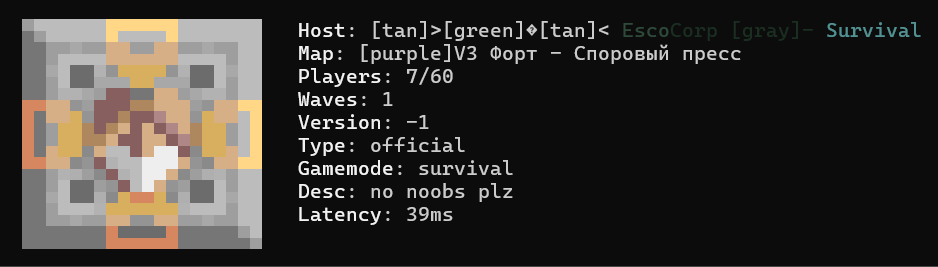

# go-mindustry-ping 0.0.1
[Go Mindustry Ping](https://go.dev/dl/](https://pkg.go.dev/github.com/altwine/go-mindustry-ping) - command-line tool to query and display information about a Mindustry server.

# CLI Usage
Firstly, download binary for your os/arch [here](https://github.com/altwine/go-mindustry-ping/releases)
```bash
# Windows usage example
go-mindustry-ping --host 121.127.37.17 --colorize --refresh 5000

# Linux & MacOS usage example
./go-mindustry-ping --host 121.127.37.17 --colorize --refresh 5000
```
* `--host <host>` - server host; (Default: 127.0.0.1)
* `--port <port>` - server port; (Default: 6567)
* `--colorize` - convert mindustry color tags to ansi-codes; (Default: false)
* `--refresh <ms>` - refresh information every N milliseconds, 0 for no refresh; (Default: 0)



# Direct API Usage
```bash
go get github.com/altwine/go-mindustry-ping@latest
```
```go
package main

import (
	"fmt"
	"log"

	"github.com/altwine/go-mindustry-ping/pkg/serverinfo"
)

func main() {
	si, err := serverinfo.GetServerInfo("omnidustry.ru", 6567)
	if err != nil {
		log.Fatal(err)
	}
	fmt.Printf("%d players is playing on omnidustry server right now!!", si.Players)
}
```

# Building
1. Install required tools: [golang compiler](https://go.dev/dl/), [UPX](https://upx.github.io).
2. Run `build.sh` in `scripts`.
3. Find binaries in `build` directory.

# Plans
This tool is still in unstable state.
- [ ] Full mindustry markup support: named colors and other strange formats
- [ ] Improve command arguments handling
- [ ] Fix exit handling
- [ ] Add information about server ip address (Like the code region where server is located)
- [ ] Different icons for non-"official" type servers like "MindustryX" and etc
- [ ] Maybe ship two different builds: with and without UPX, because anti-viruses don't like UPX much
